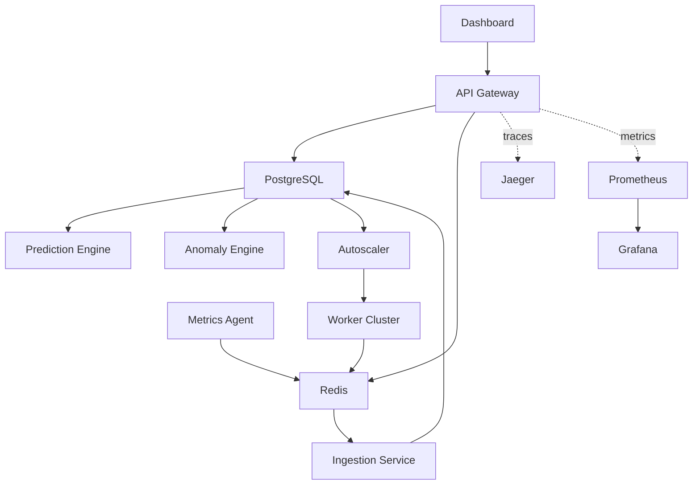

# ScaleGuard X

ScaleGuard X is a learning-focused infrastructure monitoring and autoscaling platform built as a multi-service Python project. It demonstrates how metrics ingestion, anomaly detection, forecasting, autoscaling, tracing, and dashboards can fit together in one system without pretending to be a drop-in replacement for Kubernetes, Datadog, or a managed APM stack.

## Current status

This repository now includes the implementation work for the first four roadmap phases:

- Phase 1: benchmark harnesses, result capture, and CI benchmark workflow scaffolding
- Phase 2: Prophet and LSTM model paths in the prediction engine with ARIMA/EMA fallbacks
- Phase 3: predictive autoscaling with PID control and multi-step scaling decisions
- Phase 4: JWT token issuance, RBAC checks, rate limiting, and request tracing in the API gateway

What it does not include yet is hard proof that every production claim has been validated in a real cloud environment. The code is moving in that direction, but several week 9-12 items still require an actual pilot deployment, real traffic, and external tool benchmarking.

## What works in this repo

- FastAPI API gateway with `/health`, `/api/metrics`, token issuance, manual scaling requests, and read APIs
- Redis-backed metric ingestion with database fallback
- Prediction engine with Prophet plus LSTM spike detection when warm-up data exists
- Predictive autoscaler that reads stored forecasts and can scale by more than one worker at a time
- Structured logging, circuit breakers, Prometheus metrics, and request tracing support
- Grafana dashboards, Prometheus config, docker-compose stack, and ECS Terraform scaffolding
- Unit and integration coverage for auth, middleware, tracing, PID control, predictive scaling, and prediction helpers

## Measured results

Measured benchmark artifacts currently checked into the repo:

| Metric | Result | Source |
| --- | --- | --- |
| `/health` latency p50 | 1.86 ms | `benchmarks/results/latency_health_endpoint.json` |
| `/health` latency p99 | 3.21 ms | `benchmarks/results/latency_health_endpoint.json` |
| Idle memory peak | 48.33 MB | `benchmarks/results/memory_at_rest.json` |

Important note:
The checked-in `throughput_1k_metrics_per_sec.json` result is not a valid success run. It recorded zero successful writes during an earlier benchmark pass before the ingestion route and payload compatibility work were finished. Throughput must be rerun before publishing any ingestion-capacity claim.

See [docs/BENCHMARKS.md](docs/BENCHMARKS.md) for details and rerun instructions.

## Architecture

## Running locally

1. Copy `.env.example` to `.env`.
2. Set strong values for `POSTGRES_PASSWORD`, `GRAFANA_ADMIN_PASSWORD`, and `JWT_SECRET_KEY`.
3. Start the stack with `docker compose up -d --build`.
4. Open:
   - Dashboard: `http://localhost:3000`
   - API docs: `http://localhost:8000/docs`
   - Prometheus: `http://localhost:9090`
   - Grafana: `http://localhost:3001`
   - Jaeger: `http://localhost:16686`

## Benchmarks and validation

- Benchmark code lives in `benchmarks/`
- Benchmark CI workflow lives in `.github/workflows/benchmark.yml`
- Competitive-analysis helper script lives in `benchmarks/competitive_analysis.py`
- Production smoke tests live in `tests/production/test_deployment.py`
- Chaos-focused service tests live in `tests/chaos/test_failure_modes.py`

## Deployment path

Week 9 delivery is represented as a pilot deployment scaffold, not a claimed production rollout:

- Terraform scaffold: [infrastructure/terraform/main.tf](infrastructure/terraform/main.tf)
- Deployment guide: [docs/DEPLOYMENT.md](docs/DEPLOYMENT.md)
- Real-world validation notes: [docs/REAL_WORLD_USAGE.md](docs/REAL_WORLD_USAGE.md)

The Terraform config targets AWS ECS Fargate with RDS PostgreSQL, ElastiCache Redis, an HTTPS ALB, and CloudWatch logs. It is intended as a starting point for a pilot, not as a guaranteed-ready production module.

## Honest positioning

Use ScaleGuard X when:

- you want to learn how monitoring and autoscaling components fit together
- you want to inspect and modify the forecasting and scaling logic directly
- you need a portfolio project that shows distributed-systems and observability patterns

Do not use ScaleGuard X as-is when:

- you need proven, high-volume production throughput numbers
- you need HA, multi-region, audited security controls, or vendor support
- you need managed alerting, mature incident tooling, or large-scale autoscaling guarantees

## Documentation

- [docs/BENCHMARKS.md](docs/BENCHMARKS.md)
- [docs/DEPLOYMENT.md](docs/DEPLOYMENT.md)
- [docs/REAL_WORLD_USAGE.md](docs/REAL_WORLD_USAGE.md)
- [docs/ONCALL_RUNBOOK.md](docs/ONCALL_RUNBOOK.md)
- [docs/api_docs.md](docs/api_docs.md)

## Development notes

- Python configuration lives in [pyproject.toml](pyproject.toml)
- Main services live in `api_gateway/`, `prediction_engine/`, `autoscaler/`, `ingestion_service/`, `anomaly_engine/`, and `metrics_agent/`
- The most meaningful verification right now is the targeted unit and integration suites, plus rerunning benchmarks against a live stack
