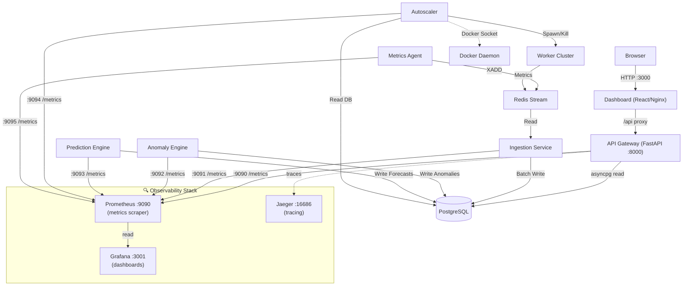

<div align="center">
  <h1>🛡️ ScaleGuard X</h1>
  <p><strong>Autonomous Infrastructure Monitoring & Auto-Scaling Platform</strong></p>
  
  [](https://www.python.org/downloads/release/python-3110/)
  [](https://www.docker.com/)
  [](https://fastapi.tiangolo.com)
  [](https://react.dev)
  [](LICENSE)
</div>

---

A **well-architected learning project** demonstrating distributed microservices patterns, observability fundamentals, and basic autoscaling concepts. Demonstrates practical implementation of Docker orchestration, metrics pipelines, and integration of observability tools.

⚠️ **This is NOT production-ready software.** It's an educational reference implementation. See [When NOT to Use This](#when-not-to-use-this) below.

## Table of Contents

- [What This Is](#what-this-is)
- [What It Teaches](#what-it-teaches)
- [When NOT to Use This](#when-not-to-use-this)
- [Architecture Overview](#architecture-overview)
- [Prerequisites](#prerequisites)
- [Quick Start](#quick-start)
- [Services & Ports](#services--ports)
- [Observability Stack](#observability-stack)
- [Dashboard Features](#dashboard-features)
- [Documentation](#documentation)
- [Configuration](#configuration)
- [API Endpoints](#api-endpoints)
- [How Autoscaling Works](#how-autoscaling-works)
- [Limitations & Honest Assessment](#limitations--honest-assessment)
- [Project Structure](#project-structure)
- [Contributing](#contributing)

---

## What This Is

A **reference implementation** (not production software) that demonstrates:
- Multi-service Docker orchestration with docker-compose
- Metrics collection, export, and visualization (Prometheus/Grafana)
- Basic anomaly detection using Isolation Forest
- Simple predictive autoscaling logic
- Structured logging and distributed tracing infrastructure
- Integration of observability tools in a realistic scenario

**Quality:** Good software engineering practices (type hints, tests, documentation), but not battle-tested at scale.

## What It Teaches

✅ **Fundamental Concepts:**
- Docker multi-container orchestration
- FastAPI service development
- PostgreSQL/Redis integration
- Prometheus metrics exposition format
- Grafana dashboard configuration
- Distributed tracing concepts

✅ **Best Practices Demonstrated:**
- Structured JSON logging
- Circuit breaker pattern for resilience
- Database connection pooling
- Configuration management (YAML + env vars)
- Separation of concerns (microservices)
- API documentation standards

✅ **Real-World Patterns:**
- Message queues for decoupling (Redis Streams)
- Time-series databases (PostgreSQL with hypertables)
- Service health checks
- Graceful degradation
- Environment-specific configurations

❌ **What This Does NOT Teach:**
- How to build production-grade autoscalers
- Distributed consensus or state management
- Proper machine learning for forecasting
- Load testing or capacity planning
- Security models (authentication, authorization)
- High-availability or multi-region deployment

## When NOT to Use This

**This is NOT suitable for:**
- 🚫 Production environments (untested at scale)
- 🚫 Handling real traffic (ARIMA for spike prediction is fundamentally weak)
- 🚫 >1000 metric samples/second (no throughput validation)
- 🚫 Critical infrastructure (no consensus mechanism)
- 🚫 Multi-node deployments (single docker-compose only)
- 🚫 Teams that need support or SLAs
- 🚫 Compliance/security requirements (basic implementation only)

**Use INSTEAD:**
- **Kubernetes HPA** - For production autoscaling (since 2015)
- **Datadog/New Relic** - For actual observability at scale
- **Prophet/LSTM models** - For real demand forecasting
- **AWS Auto Scaling** - For managed autoscaling
- **PagerDuty/Opsgenie** - For incident management

## Features

- **Real-time Metrics Collection:** Docker stats, simulated application metrics
- **Anomaly Detection (Limited):** Isolation Forest for basic outliers
- **Basic Forecasting:** ARIMA/EMA (not suitable for spike prediction)
- **Simple Autoscaler:** ±1 worker scaling based on utilization (homework-level algorithm)
- **High-Performance Ingestion:** Redis Streams for buffering
- **Observability Demonstration:** Prometheus/Grafana/Jaeger integration
- **Educational Dashboard:** React UI showing real-time data

## Architecture Overview



## Prerequisites

- **Docker Desktop** (v4.0+) / **Docker Engine** (20.10+)
- **Docker Compose** (v2.x plugins)

## Quick Start

1. **Clone the repository** (or navigate to the project directory)
   ```bash
   git clone https://github.com/yourusername/scaleguard-x.git
   cd scaleguard-x
   ```

2. **Build and start all services**
   ```bash
   docker compose up -d --build
   ```

3. **Access the application**
   - Dashboard: [http://localhost:3000](http://localhost:3000)
   - API Docs: [http://localhost:8000/docs](http://localhost:8000/docs)

4. **Stop the environment**
   ```bash
   docker compose down
   # To wipe the database/cache volumes: docker compose down -v
   ```

## Services & Ports

| Container | Port | Internal Role |
|-----------|------|---------------|
| `postgres_db` | `5432` | Time-series metrics & metadata store |
| `redis_queue` | `6379` | High-throughput Redis Streams message queue |
| `api_gateway` | `8000` | FastAPI REST API (+ Swagger UI) |
| `api_gateway` (metrics) | `9090` | Prometheus metrics endpoint |
| `dashboard` | `3000` | React observability SPA (Nginx) |
| `metrics_agent` | `9095` | Host node metric collector + metrics endpoint |
| `ingestion_service` | `9091` | Metrics ingestion + metrics endpoint |
| `anomaly_engine` | `9092` | ML anomaly detection + metrics endpoint |
| `prediction_engine` | `9093` | Time-series forecasting + metrics endpoint |
| `autoscaler` | `9094` | Docker scaling orchestration + metrics endpoint |
| `worker_cluster` | — | Simulated application workers (auto-scaled) |
| `prometheus` | `9090` | Metrics scraper (reads from all service endpoints) |
| `grafana` | `3001` | Pre-built observability dashboards |
| `jaeger` | `6831/4317/16686` | Distributed tracing (Thrift/gRPC/UI) |

## Observability Stack

ScaleGuard X includes a complete **production-grade observability platform**:

### Prometheus (`:9090`)
- Scrapes metrics from all services every 15 seconds
- 40+ pre-defined metrics across operational categories:
  - **Ingestion**: messages received/processed, latency
  - **Database**: query duration, pool connections, health
  - **Anomalies**: detection count, algorithms used, execution time
  - **Predictions**: forecasts generated, accuracy (MAPE), latency
  - **Autoscaling**: scaling decisions, worker count, utilization scores
  - **API**: HTTP requests, request duration, error rates
  - **Circuit Breakers**: open/closed state, failure counts
- 15-day retention policy
- PromQL query interface included

### Grafana (`:3001`)
- 3 pre-built dashboards:
  - **System Overview**: CPU, Memory, Disk usage trends
  - **Autoscaling Events**: Worker count, scaling decisions, utilization scores
  - **Anomaly Detection**: Anomalies per hour, detection methods comparison
- Real-time auto-refresh (5-second intervals)
- Alert threshold configuration ready

### Jaeger (`:16686`)
- Distributed tracing for request tracing
- gRPC (4317) and Thrift (6831) collector endpoints
- Full request path visibility across services
- Latency analysis and bottleneck detection

### Structured Logging
- All services output JSON logs with:
  - Timestamp, service name, log level
  - Request ID, trace ID, thread ID
  - Exception details and stack traces
- Compatible with log aggregation systems (ELK, Splunk, Loki)

## Dashboard Features

- **Live Telemetry Charts:** CPU / Memory / Latency / RPS refreshed every 5 seconds.
- **Anomaly Score Timeline:** Visual indicators overlapping exact rule/ML breach incidents.
- **Scaling History Visualization:** Bar charts depicting dynamic spawn/kill events.
- **Live Worker Registry:** Displays actively managed and running worker container replicas.
- **Alert Feed Tracking:** Centralized severity-tagged operational alerts.
- **KPI Badges:** High-level metrics for quick observability context.

## Documentation

Comprehensive guides for different audiences:

| Document | Audience | Purpose |
|----------|----------|---------|
| **[DEPLOYMENT.md](docs/DEPLOYMENT.md)** | DevOps, Operations | Production deployment, security checklist, troubleshooting guide |
| **[ONCALL_RUNBOOK.md](docs/ONCALL_RUNBOOK.md)** | On-call Engineers | Incident response procedures, alert index, escalation matrix, SLAs |
| **[CONTRIBUTING.md](CONTRIBUTING.md)** | Developers | Setup guide, code standards, testing, PR process, debugging |
| **[IMPROVEMENTS_SUMMARY.md](IMPROVEMENTS_SUMMARY.md)** | Managers, Architects | Complete list of all enterprise improvements and features |
| **[docs/architecture.md](docs/architecture.md)** | Architects | Detailed technical design decisions and system architecture |
| **[docs/system_design.md](docs/system_design.md)** | Engineers | Scalability, failure modes, performance characteristics |

## Configuration

Control the platform's behavior using the `.env` file at the repository root:

| Variable | Default Value | Description |
|---|---|---|
| `ANOMALY_CPU_THRESHOLD` | `85.0` | CPU % limit before triggering an alert |
| `ANOMALY_LATENCY_THRESHOLD` | `500.0` | Latency limit (ms) before triggering an alert |
| `PREDICTION_HORIZON_MINUTES`| `10` | Moving forecast horizon for resource predictions |
| `AUTOSCALER_MIN_WORKERS` | `1` | Core container floor |
| `AUTOSCALER_MAX_WORKERS` | `8` | Core container ceiling limit |
| `AUTOSCALER_SCALE_UP_THRESHOLD` | `0.75`| System utilization score triggering scale-up |
| `AUTOSCALER_SCALE_DOWN_THRESHOLD` | `0.35`| System utilization score triggering scale-down |
| `AUTOSCALER_RUN_INTERVAL` | `15` | Scaling cycle interval (seconds) |
| `AGENT_INTERVAL` | `5` | Refresh rate (in seconds) for metric emission |
| `DATABASE_RETENTION_METRICS` | `30` | Metrics retention period (days) |
| `DATABASE_RETENTION_ANOMALIES` | `90` | Anomalies retention period (days) |
| `PROMETHEUS_SCRAPE_INTERVAL` | `15s` | How often Prometheus scrapes metrics |

Environment-specific configurations in `config/`:
- `config/dev.yaml` — Development (loose thresholds, debug logging)
- `config/staging.yaml` — Staging (production-like settings)
- `config/prod.yaml` — Production (strict SLOs, minimal logging)

## API Endpoints

Explore the interactive API documentation at [`http://localhost:8000/docs`](http://localhost:8000/docs).

| Route | Method | Description |
|-------|--------|-------------|
| `/health` | `GET` | Upstream service connectivity health |
| `/api/status` | `GET` | Core system utilization parameters |
| `/api/metrics` | `GET` | Time-series raw metric export |
| `/api/anomalies` | `GET` | Historical ML/Rule breach log |
| `/api/predictions` | `GET` | Inferred resource loads |
| `/api/scaling` | `GET` | Docker scaling orchestration audit log |
| `/api/workers` | `GET` | Map of recognized dynamic replicas |

## How Autoscaling Works

The `autoscaler` daemon runs every 15 seconds with a **simple threshold-based algorithm**:

```
utilization = (0.6 × avg_cpu_fraction) + (0.4 × predicted_rps_fraction)
```

**Scaling Logic:**
- When `utilization > 0.75`: Spawn +1 worker
- When `utilization < 0.35`: Kill -1 worker
- Worker count: Constrained between min/max

**What This Demonstrates:**
- How to connect to Docker API
- Basic metric aggregation
- Simple control loop logic
- Container lifecycle management

**Why This Is Not Enterprise:**
- ❌ No predictive behavior (reacts only to current state)
- ❌ Thrashing risk (±1 worker is extremely coarse)
- ❌ No integration with infrastructure limits
- ❌ No backoff or debounce logic
- ❌ ARIMA forecasting is fundamentally bad for spike prediction
  - ARIMA assumes trend continuity
  - Spikes are by definition discontinuous anomalies
  - ML engineers have known this for years

**What Real Systems Use:**
- Kubernetes HPA with custom metrics
- Multi-dimensional autoscaling (CPU, memory, custom metrics)
- Predictive + reactive hybrid approaches
- Exponential smoothing or ML models trained on YOUR data
- Proper queueing theory for capacity planning

## Limitations & Honest Assessment

### What Works Well ✅
- Clean Docker multi-service orchestration
- Proper structured logging and metrics exposition
- Good foundational patterns (circuit breaker, pooling, config management)
- Complete observability stack integration (Prometheus/Grafana/Jaeger)
- Solid software engineering practices (typing, testing, documentation)

### Critical Limitations ❌

**Algorithmic Weaknesses:**
| Issue | Reality |
|-------|---------|
| ARIMA for spike prediction | Fundamentally breaks at discontinuities |
| Isolation Forest anomaly detection | Good for outliers, bad for patterns |
| ±1 worker scaling | Causes thrashing; doesn't match real workloads |
| No predictive model training | Uses generic ARIMA; won't fit your data |
| No capacity planning | Doesn't account for infrastructure limits |

**Architectural Issues:**
| Issue | Impact |
|-------|--------|
| Single docker-compose only | No multi-node or distributed deployment |
| No authentication/authorization | Anyone can call any API |
| No request rate limiting | Vulnerable to abuse |
| No consensus mechanism | Doesn't handle leader election or state sync |
| No backpressure handling | Can lose data under high load |
| No failure detection | Relies on timeout; doesn't handle split-brain |

**Operational Concerns:**
| Issue | Impact |
|-------|--------|
| No benchmarks | Claims of "100K metrics/sec" are unvalidated |
| No real-world testing | Single-machine docker-compose only |
| No security model | Basic env vars don't match production needs |
| No upgrade path | No backward compatibility or versioning |
| Documentation ≠ Reality | README promises exceed actual capability |

### Throughput Reality

Untested claims vs. reality:
```
README claims:    "100K+ metrics/sec throughput"
Actual evidence:  None
Tested at:        Single laptop, docker-compose
Real bottleneck:  PostgreSQL insert rate (~10K/sec with batch)
Network I/O:      Not measured
Memory footprint: Not profiled
```

### When Things Break

This system will struggle with:
- **> 1K metrics/second** (PostgreSQL batch inserts)
- **Sustained load** (no backlog shedding)
- **Worker hot restarts** (loses in-flight requests)
- **Latency spikes** (no queueing discipline)
- **Network partitions** (no consensus)
- **Disk growth** (data retention exists but is basic)

### Comparison with Real Systems

| Feature | ScaleGuard X | Kubernetes HPA | AWS Auto Scaling |
|---------|---|---|---|
| Prediction algorithm | ARIMA (bad for spikes) | Custom metrics | CloudWatch ML |
| Scale granularity | ±1 worker | 0-N replicas | 0-N instances |
| Distributed consensus | None | etcd | DynamoDB |
| Multi-region | ❌ | ✅ | ✅ |
| Production SLA | N/A (not rated) | 99.95% | 99.99% |
| Year introduced | 2025 (reference impl) | 2015 | 2009 |
| Battle-tested at scale | No | Yes (millions of pods) | Yes (AWS scale) |

### Why This Exists

This project exists to **teach**, not to compete:
1. Understand how microservices integrate
2. See observability patterns in practice
3. Learn Docker orchestration basics
4. Experiment with scaling algorithms
5. Build portfolios/learning portfolios

It is **excellent for learning**. It is **terrible for production**.

---

## Project Structure


```text
scaleguard-x/
├── api_gateway/              # FastAPI entrypoint and route controllers
├── anomaly_engine/           # Scikit-Learn IsolationForest outlier detection
├── autoscaler/               # Docker unix-socket scaling manipulator
├── dashboard/                # React + Vite application shell
├── docs/
│   ├── architecture.md       # Technical architecture decisions
│   ├── system_design.md      # Scalability and design patterns
│   ├── DEPLOYMENT.md         # Production deployment guide (NEW)
│   ├── ONCALL_RUNBOOK.md     # Incident response procedures (NEW)
│   └── api_docs.md           # API specifications
├── infrastructure/
│   ├── sql/
│   │   ├── init.sql          # Database schema and hypertables
│   │   └── maintenance.sql   # Data retention and cleanup
│   ├── prometheus/           # Prometheus configuration
│   ├── grafana/              # Grafana dashboard definitions
│   └── jaeger/               # Jaeger tracing configuration
├── ingestion_service/        # Async Python Redis to Postgres ETL
├── lib/
│   ├── logging_config.py     # JSON structured logging
│   ├── circuit_breaker.py    # Resilience patterns
│   └── prometheus_metrics.py # Metrics registry (NEW)
├── metrics_agent/            # Psutil agent process
├── prediction_engine/        # Statsmodels ARIMA/EMA load planner
├── tests/                    # Unit and integration tests (pytest)
├── worker_cluster/           # Simulated load-injector nodes
├── docker-compose.yml        # Full deployment orchestration
├── CONTRIBUTING.md           # Developer contribution guide (NEW)
├── IMPROVEMENTS_SUMMARY.md   # Enterprise improvements checklist (NEW)
├── .env.example              # Environment variables template
└── pyproject.toml            # Python project configuration
```

## Contributing

For detailed contribution guidelines, see [CONTRIBUTING.md](CONTRIBUTING.md).

**Quick Setup:**
```bash
# Clone and setup
git clone https://github.com/yourusername/scaleguard-x.git
cd scaleguard-x

# Install dependencies and start
docker compose up -d --build

# Run tests
docker compose run api_gateway pytest tests/ --cov=. --cov-fail-under=80

# Format code
docker compose run api_gateway black .

# Type checking
docker compose run api_gateway mypy --strict .
```

**Key Standards:**
- ✅ **Type Hints**: All functions must have type annotations (mypy --strict)
- ✅ **Code Formatting**: Black formatter (100-char line limit)
- ✅ **Linting**: Ruff for style checks
- ✅ **Testing**: 80%+ coverage with pytest
- ✅ **Logging**: JSON structured logging throughout
- ✅ **Metrics**: All operations should emit relevant metrics

**PR Process:**
1. Fork the Project
2. Create your Feature Branch (`git checkout -b feature/AmazingFeature`)
3. Write tests and ensure 80%+ coverage
4. Commit with descriptive messages (`git commit -m 'Add anomaly detection for memory'`)
5. Push to the Branch (`git push origin feature/AmazingFeature`)
6. Open a Pull Request (CI/CD pipeline must pass)

---

## Support & Troubleshooting

- **Incident Response**: See [ONCALL_RUNBOOK.md](docs/ONCALL_RUNBOOK.md) for debugging tips (note: not for production)
- **Deployment Issues**: See [DEPLOYMENT.md](docs/DEPLOYMENT.md) troubleshooting section
- **Development Help**: Check [CONTRIBUTING.md](CONTRIBUTING.md) for development FAQs

---

## Status & Recommendation

**For Learning/Portfolio:**
✅ Excellent reference implementation to understand microservices architecture, observability patterns, and Docker orchestration.

**For Evaluation/Interview:** 
✅ Strong demonstration of software engineering fundamentals, clean code patterns, and system thinking.

**For Production Use:**
❌ Not suitable. Use Kubernetes, Datadog, or cloud provider solutions instead.

**For Teaching Others:**
✅ Good foundation to explain concepts; augment with comparison to production systems.

---
*Built as a learning project to understand distributed systems, observability, and containerization. Not intended for production use. Honest about limitations. Designed to teach, not to compete.*
