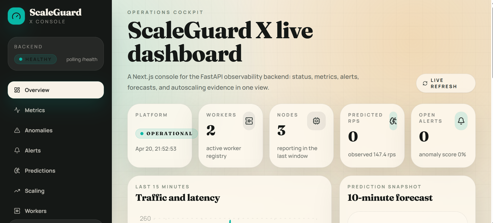
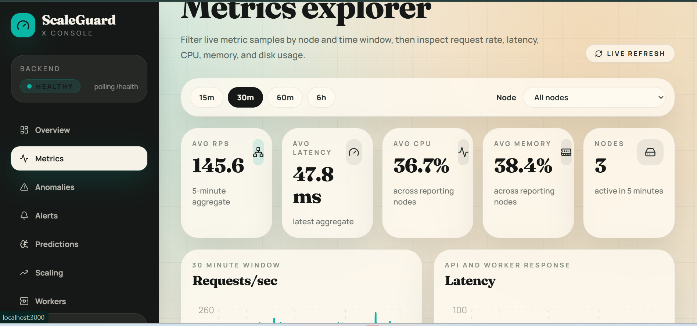
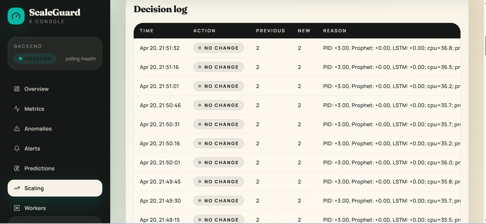

# ScaleGuard X Next.js Dashboard

Next.js App Router dashboard for the ScaleGuard X FastAPI backend. It visualizes platform health, metrics, anomalies, alerts, predictions, scaling events, and worker status.

## Run Locally

```bash
cd dashboard-next
npm install
npm run dev
```

Set the backend URL in `.env.local`:

```env
NEXT_PUBLIC_API_BASE_URL=http://localhost:8000
```

The dashboard polls the existing FastAPI endpoints and does not require backend changes beyond CORS, which ScaleGuard already enables.

## Screenshots







## Pages

- Overview: health, KPIs, unresolved alerts, predictions, scaling, active nodes.
- Metrics: node/time filters, CPU, memory, latency, RPS, disk charts, raw rows.
- Anomalies: score badges, time filters, anomaly table.
- Alerts: unresolved toggle, severity tabs, alert feed.
- Scaling: autoscaling timeline and replica transitions.
- Predictions: forecast chart and confidence snapshot.
- Workers: registered workers and recently reporting nodes.
