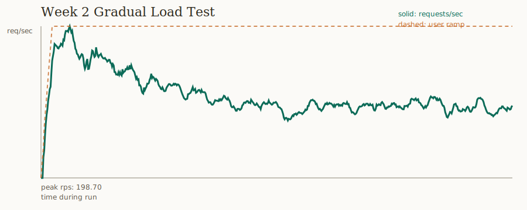
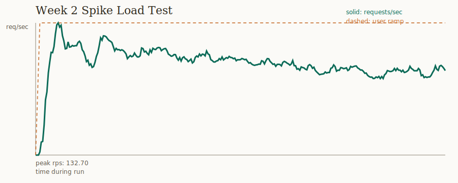
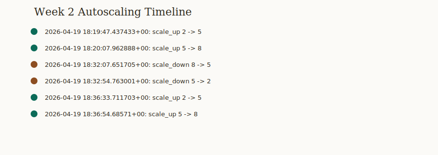

# Week 2 Validation Evidence

This document captures the completed local week-2 validation work for ScaleGuard X.

## Load Test Summary

| Test | Duration | Peak users | Requests | Failures | Peak throughput | Estimated metrics ingested |
| --- | ---: | ---: | ---: | ---: | ---: | ---: |
| Gradual ramp | 10 minutes | 150 | 65,228 | 0 | 198.70 req/sec | 195,605 |
| Spike | 5 minutes | 300 | 27,896 | 0 | 132.70 req/sec | 83,965 |

Source artifacts:

- `benchmarks/results/LOAD_TEST_GRADUAL_2026-04-19.md`
- `benchmarks/results/LOAD_TEST_SPIKE_2026-04-20.md`
- `benchmarks/results/load_test_gradual_2026-04-19_2350_stats.csv`
- `benchmarks/results/load_test_spike_2026-04-20_0006_stats.csv`

## Autoscaling Proof

Autoscaling was verified from the `scaling_events` table, not only from container logs.

| Test window | Observed scaling |
| --- | --- |
| Gradual ramp | `2 -> 5 -> 8` workers |
| Post-gradual cooldown | `8 -> 5 -> 2` workers |
| Spike | `2 -> 5 -> 8` workers |

Exported evidence:

- `benchmarks/results/week2_scaling_events.csv`
- `docs/images/week2_autoscaling_timeline.svg`
- `docs/images/week2_gradual_requests_per_second.svg`
- `docs/images/week2_spike_requests_per_second.svg`

## Visual Evidence







These are generated directly from the Locust CSVs and Postgres scaling events. They replace manual Grafana screenshots for this local terminal run because browser screenshot capture was not available in the current environment.

## Findings

What passed:

- The write-heavy ingest path stayed available during both gradual and spike load.
- Both load tests completed with 0 request failures.
- The autoscaler scaled from the 2-worker floor to the 8-worker cap during both measured test windows.
- The autoscaler scaled back down after load subsided.
- The deployment image set builds locally with `scripts/build_week2_images.ps1`.

What needs follow-up:

- `GET /api/metrics` and `GET /api/status` show multi-second p95 and p99 latency under load.
- The default prediction image uses ARIMA/EMA fallbacks. Full Prophet/LSTM dependencies are available through `prediction_engine/requirements-ml.txt` and `INSTALL_ML_EXTRAS=true`, but that larger image was not used for the week-2 deployment-prep build.
- Terraform and AWS CLI are not installed on this machine, so `terraform init`, `terraform plan`, ECR login, and image push were not executed locally.

## AWS Deployment Prep Status

Completed:

- Terraform now includes API, ingestion, prediction, worker, and autoscaler ECS services.
- The autoscaler supports `AUTOSCALER_BACKEND=ecs` and can update an ECS worker service desired count.
- `infrastructure/terraform/terraform.tfvars.example` documents the required AWS inputs.
- `scripts/build_week2_images.ps1` builds and optionally tags/pushes the deployment image set.
- Local images built successfully:
  - `scaleguard-api:latest`
  - `scaleguard-ingestion:latest`
  - `scaleguard-prediction:latest`
  - `scaleguard-worker:latest`
  - `scaleguard-autoscaler:latest`

Blocked by local workstation tooling:

- `terraform` command is not installed.
- `aws` command is not installed.
- No AWS account credentials or ECR registry were available in this environment.

## Rerun Commands

Build deployment images:

```powershell
powershell -ExecutionPolicy Bypass -File scripts\build_week2_images.ps1
```

Tag for ECR after installing and logging into AWS CLI:

```powershell
$accountId = aws sts get-caller-identity --query Account --output text
$region = "us-east-1"
$registry = "$accountId.dkr.ecr.$region.amazonaws.com"
aws ecr get-login-password --region $region | docker login --username AWS --password-stdin $registry
powershell -ExecutionPolicy Bypass -File scripts\build_week2_images.ps1 -Registry $registry -Push
```

Validate Terraform once Terraform and AWS CLI are installed:

```powershell
cd infrastructure\terraform
copy terraform.tfvars.example terraform.tfvars
# Edit terraform.tfvars with real VPC, subnet, certificate, secret, and ECR values.
terraform init
terraform fmt -check
terraform validate
terraform plan
```
